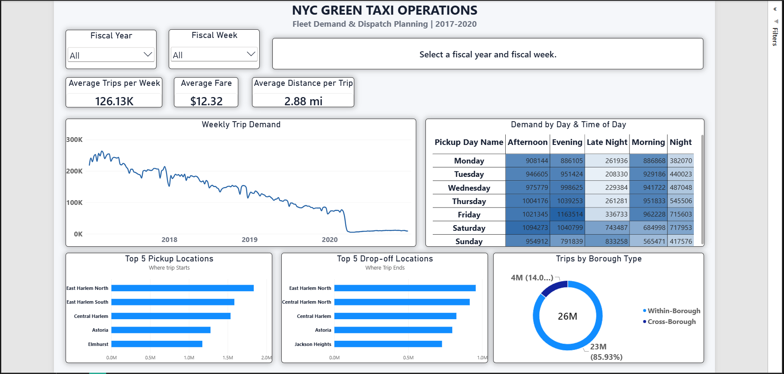

# NYC Green Taxi Operations

### End-to-End Business Analytics | Python • PostgreSQL • Power BI

An end-to-end business analytics project analyzing New York City Green Taxi trip data from 2017 to 2020 to understand demand patterns, trip characteristics, geographic activity, and operational planning opportunities.

The project transforms raw trip-level data into business insights through data cleaning, SQL analysis, data modeling, and interactive Power BI reporting.

---

## Table of Contents

1. Project Overview
2. Business Scenario
3. Business Questions
4. Dataset and Scope
5. Technology Stack
6. Project Workflow
7. Data Cleaning and Quality Assurance
8. Database Design
9. SQL Analysis
10. Power BI Dashboard
11. Key Business Findings
12. Operational Implications
13. Data Limitations
14. Repository Structure
15. How to Explore the Project
16. Data Source and Attribution
17. Author

---

## 1. Project Overview

NYC Green Taxi Operations is an end-to-end business analytics project focused on understanding historical taxi demand and identifying patterns that may support fleet demand analysis and dispatch planning in New York City.

The project uses Green Taxi trip records covering 2017–2020. Python and Pandas were used to clean and validate the source data, PostgreSQL was used to perform business analysis, and Power BI was used to develop an interactive dashboard.

The analysis examines trip volumes, weekly and daily demand, fare and distance metrics, pickup and drop-off locations, and travel patterns within and across New York City's five boroughs.

### Project Objectives

- Understand historical changes in Green Taxi trip volumes.
- Identify recurring demand patterns by week, day, and hour.
- Analyze average fare and trip distance.
- Identify high-activity pickup and drop-off locations.
- Examine within-borough and cross-borough travel patterns.
- Develop an interactive business intelligence report for operational analysis.

The project demonstrates an end-to-end analytics workflow, from raw data preparation to business interpretation.

## 2. Business Scenario

This project is based on the [Maven Analytics Taxi Challenge](https://mavenanalytics.io/challenges/maven-taxi-challenge).

The challenge presents a business scenario in which a Lead Dispatcher is responsible for weekly planning and logistics.

Understanding when demand occurs, where trips originate and terminate, and how demand changes over time can help inform operational planning and resource allocation.

This analysis focuses on historical patterns and descriptive insights. It does not attempt to forecast future demand or establish the causes of changes in trip volume.

## 3. Business Questions

The analysis addresses the six core business questions from the challenge:

| No. | Business question | Analytical focus |
|---|---|---|
| 1 | How many trips should be expected on average? | Trip volumes and weekly demand |
| 2 | What is the average fare per trip? | Average fare amount |
| 3 | What is the average distance per trip? | Average trip distance |
| 4 | How has trip volume changed compared with the previous week? | Week-over-week trip changes |
| 5 | What are the busiest days and times? | Demand by day of week and pickup hour |
| 6 | What are the most popular pickup and drop-off locations? | Geographic demand and location rankings |

Additional analysis examines borough-level travel patterns and data quality.

## 4. Dataset and Scope

### Dataset

The project uses the NYC Green Taxi trip dataset provided through the Maven Analytics Taxi Challenge.

- **Source:** Maven Analytics
- **Dataset:** Green Taxi trip records
- **Analysis period:** 2017–2020
- **Geographic scope:** New York City
- **Grain:** Individual taxi trip records

The original records contain trip timestamps, passenger counts, trip distances, fare and payment information, and pickup and drop-off location identifiers.

Taxi zone reference data and a calendar dimension are used to support geographic and time-based analysis.

### Final Fact Table

The cleaned and loaded PostgreSQL fact table contains 26,279,287 trips.

| Source year | Trip records |
|---|---:|
| 2017 | 11,379,157 |
| 2018 | 8,454,334 |
| 2019 | 5,293,041 |
| 2020 | 1,152,755 |
| **Total** | **26,279,287** |

These counts represent the final loaded fact table, not the original uncleaned source records.

## 5. Technology Stack

| Technology | Purpose |
|---|---|
| Python | Data preparation, cleaning, and validation |
| Pandas | Data transformation and quality checks |
| PostgreSQL | Data storage, relational modeling, and SQL analysis |
| Power BI Desktop | Interactive reporting and dashboard development |
| DAX | Measures and analytical calculations |
| Power Query | Data preparation and transformation within Power BI |
| GitHub | Version control and project documentation |

## 6. Project Workflow

The project follows a structured analytics workflow.

### 1. Data Preparation

Raw Green Taxi data was processed using Python and Pandas. Cleaning rules were applied to improve consistency and address invalid or incomplete records.

### 2. Data Quality Assurance

Separate Python validation and audit scripts were used to examine date consistency, financial values, unknown locations, and other data quality issues.

### 3. Database Development

The cleaned data was loaded into PostgreSQL. A trip-level fact table and supporting dimensions were organized for analytical querying.

### 4. Business Analysis

SQL queries were developed to examine historical demand, time-based patterns, geographic activity, fare and distance metrics, and borough routes.

### 5. Business Intelligence

Power BI was connected to PostgreSQL in Import mode. A relational model and DAX measures were developed to support interactive analysis.

### 6. Business Interpretation

The analytical results were translated into descriptive findings and operational considerations relevant to demand monitoring and dispatch planning.

## 7. Data Cleaning and Quality Assurance

Data cleaning was performed using Python and Pandas before loading the cleaned records into PostgreSQL.

The cleaning process followed the challenge's documented data preparation rules.

### Cleaning Rules Applied

| Area | Cleaning treatment |
|---|---|
| Store-and-forward trips | Removed |
| Rate type | Retained standard street-hail rate trips |
| Payment type | Retained card and cash transactions |
| Date range | Restricted to 2017–2020 |
| Unknown taxi zones | Removed from the cleaned analytical data |
| Missing passenger counts | Replaced with 1 |
| Reversed timestamps | Pickup and drop-off timestamps swapped where reversed |
| Trip duration | Trips exceeding 24 hours removed |
| Zero distance and zero fare | Trips with both values equal to zero removed |
| Negative financial values | All-negative financial fields corrected to positive values |
| Positive fare with zero distance | Distance imputed using (fare amount - 2.5) / 2.5 |
| Positive distance with zero fare | Fare imputed using 2.5 + (distance × 2.5) |

The imputation rules above were applied to the relevant records as part of the cleaning process.

### Quality Assurance

Additional Python scripts were created to validate and audit the cleaned data.

The repository includes scripts for:

- Data profiling and initial inspection.
- Date profiling and date consistency.
- Financial value validation.
- Unknown taxi zone checks.
- Data quality validation.
- Cleaning audit output.

The cleaning and validation scripts are maintained separately from the original source data and the final analytical database.

## 8. Database Design

The PostgreSQL database is named `maven_taxi`.

The analytical model separates trip-level facts from descriptive dimensions.

### Fact Table

**`fact_taxi_trip`**

The central fact table contains cleaned trip-level records and the measures and keys used for analysis.

It supports calculations such as:

- Total trip count
- Average fare amount
- Average trip distance
- Weekly and daily trip volume
- Pickup and drop-off activity
- Borough route classification

### Dimension Tables

| Table | Purpose |
|---|---|
| `dim_calendar` | Calendar attributes for time-based analysis |
| `dim_pickup_zone` | Pickup location and zone attributes |
| `dim_dropoff_zone` | Drop-off location and zone attributes |

The taxi zone dimensions are based on the taxi zone reference data. The zone dimension contains 265 location records.

The calendar dimension was loaded from the calendar source file and provides attributes such as fiscal year, fiscal quarter, fiscal month, and fiscal week.

### Power BI Relationships

The Power BI model uses one-to-many relationships from the dimensions to the fact table.

- `dim_calendar[date]` → `fact_taxi_trip[pickup_date]`
- `dim_pickup_zone[locationid]` → `fact_taxi_trip[pulocationid]`
- `dim_dropoff_zone[locationid]` → `fact_taxi_trip[dolocationid]`

The relationships use single-direction filtering from dimensions to the fact table.

This model supports time-based, pickup-based, and drop-off-based reporting.

## 9. SQL Analysis

PostgreSQL was used to perform the main business analysis.

The SQL work covers the following areas:

### Historical Demand

- Annual trip volume
- Year-over-year changes in trip volume
- Weekly trip activity
- Average trips per week

### Time-Based Analysis

- Trip volume by day of week
- Trip volume by pickup hour
- Day-and-hour demand patterns
- Week-over-week changes

### Fare and Distance Analysis

- Average fare per trip
- Average distance per trip
- Trip-level analytical metrics

### Geographic Analysis

- Pickup and drop-off activity by taxi zone
- Borough-level pickup distribution
- Within-borough and cross-borough trip classification
- Cross-borough route volumes

The SQL analysis is available in the repository's `Analysis.sql` file.

## 10. Power BI Dashboard

The Power BI report brings together the key operational metrics and demand patterns in an interactive dashboard.

**[Download the Power BI Report (.pbix)](https://drive.google.com/drive/folders/1rXSfNFxsnaFnGsjD00w4Zc5OA8eRO1Vy?usp=drive_link)**

Power BI Desktop is required to open the report.

### Dashboard Preview



*Main dashboard preview — replace this image with the actual Power BI dashboard screenshot.*

### Dashboard Components

| Component | Purpose |
|---|---|
| KPI cards | Display trip volume, average fare, average distance, and selected-period metrics |
| Fiscal Year and Fiscal Week slicers | Support analysis of selected periods |
| Weekly Trip Demand line chart | Display historical weekly trip volumes across 2017–2020 |
| Day and Time matrix | Compare demand across days of the week and time periods |
| Top 5 Pickup Locations | Identify pickup locations with high trip activity |
| Top 5 Drop-off Locations | Identify drop-off locations with high trip activity |
| Within vs Cross-Borough donut chart | Show the distribution of qualifying within-borough and cross-borough trips |
| Weekly commentary | Display the selected week's date range and week-over-week comparison |

The weekly demand chart is designed to preserve the historical time series across the full analysis period while the other visuals support selected-period analysis.

## 11. Key Business Findings

The following findings are based on the completed SQL analysis of the cleaned dataset.

### 1. Annual Trip Volume

| Year | Trips | Change from previous year |
|---|---:|---:|
| 2017 | 11.38 million | — |
| 2018 | 8.45 million | -25.70% |
| 2019 | 5.29 million | -37.39% |
| 2020 | 1.15 million | -78.22% |

Trip volumes declined across the four-year analysis period. The largest year-over-year percentage decline in this period occurred between 2019 and 2020.

These are descriptive changes in the observed trip records; the analysis does not establish their causes.

### 2. Demand by Day and Time

- Saturday recorded the highest average trip volume by day of week, followed by Friday.
- Monday recorded the lowest average trip volume by day of week.
- 6 PM was the highest-demand pickup hour in the overall analysis.
- Friday at 6 PM was the highest-demand day-and-hour combination, with approximately 1,477 average trips per day in the analysis.

These patterns identify recurring historical concentrations of trip activity.

### 3. Pickup Distribution by Borough

The following percentages represent pickup distribution among the five boroughs.

| Borough | Share of pickups |
|---|---:|
| Manhattan | 33.90% |
| Brooklyn | 32.17% |
| Queens | 29.50% |
| Bronx | 4.41% |
| Staten Island | 0.02% |

Manhattan, Brooklyn, and Queens accounted for the majority of pickup activity in the analyzed borough-level records.

### 4. Within-Borough and Cross-Borough Trips

Among qualifying trips with both pickup and drop-off locations within the five boroughs:

| Trip classification | Share |
|---|---:|
| Within-borough trips | 85.93% |
| Cross-borough trips | 14.07% |

The results indicate that most qualifying trips remained within the same borough, while a smaller proportion crossed borough boundaries.

### 5. Within-Borough Trip Share by Borough

| Borough | Within-borough share |
|---|---:|
| Manhattan | 90.19% |
| Queens | 89.48% |
| Brooklyn | 80.03% |
| Bronx | 72.58% |
| Staten Island | 42.84% |

These percentages describe the within-borough share for trips associated with each borough in the completed analysis.

### 6. Major Cross-Borough Routes

The highest-volume cross-borough routes included:

| Route | Trip volume |
|---|---:|
| Brooklyn → Manhattan | 1.238 million |
| Manhattan → Bronx | 638,000 |
| Queens → Manhattan | 487,000 |
| Brooklyn → Queens | 404,000 |

The four routes together represented approximately 75.05% of the analyzed cross-borough trip volume.

This identifies a concentration of cross-borough activity along a relatively small number of routes.

## 12. Operational Implications

The findings can inform further operational planning and investigation.

| Finding | Potential operational consideration |
|---|---|
| Higher historical demand on Fridays and Saturdays | Review historical staffing and vehicle allocation patterns for these days |
| Demand concentration around 6 PM | Examine whether dispatch coverage during the evening peak aligns with observed activity |
| High activity in Manhattan, Brooklyn, and Queens | Consider borough-level demand when reviewing fleet distribution |
| Concentrated cross-borough routes | Examine vehicle positioning and demand balancing around major route corridors |
| Significant historical changes in trip volumes | Use period-specific demand patterns rather than assuming historical demand is constant |

These are analytical considerations, not measured improvements or proven causal effects. The project does not quantify cost savings, waiting-time reductions, or the optimal number of vehicles required.

## 13. Data Limitations

The following limitations are important when interpreting the results.

### Historical Data

The analysis covers 2017–2020. The findings describe the historical records and should not be interpreted as current taxi demand or a forecast of future activity.

### Data Cleaning and Imputation

The analytical dataset has been cleaned using documented rules. Missing or invalid values were handled through removal, correction, or imputation where specified.

Imputed values are estimates and should not be treated as directly observed measurements.

### Source-Year and Date Validation

Date validation identified 1,121 source-year mismatches, approximately 0.004% of the fact records.

Source-year provenance was retained, and the mismatched records were excluded from the relevant year-based analysis.

### Calendar Dimension Coverage

The loaded calendar dimension covers February 5, 2017, through January 30, 2021, while the fact table contains trips beginning January 1, 2017.

This means 1,192,048 fact records fall before the available calendar dimension coverage. Calendar-based visuals and measures may not include those records in the same way as fact-table-based calculations.

The date coverage limitation is documented rather than silently corrected.

### Geographic Scope

Borough-level comparisons and cross-borough route analysis use qualifying trips with known pickup and drop-off zones within the five boroughs. They do not represent every trip in the complete fact table.

## 14. Repository Structure

The repository contains the SQL analysis, Python cleaning and validation scripts, and the cleaning audit output.

```text
nyc-green-taxi-operations/
│
├── README.md
├── .gitignore
├── Analysis.sql
│
├── Taxi_Cleaning.py
├── Taxi_Cleaning_Audit.csv
├── Taxi_DataQuality_Pass2.py
├── Taxi_Date_Profile.py
├── Taxi_FinancialCorrection_Check.py
├── Taxi_Profile_Pass1.py
└── Taxi_UnknownZone_Check.py
```

The Power BI report is provided through the linked Google Drive folder.

The dashboard screenshot will be added to the repository and displayed in this README.

## 15. How to Explore the Project

### 1. Review the Documentation

Start with this README to understand the business scenario, dataset, analytical workflow, findings, and limitations.

### 2. Explore the Python Scripts

Review the cleaning and validation scripts to understand how the raw data was prepared and checked before database loading.

### 3. Explore the SQL Analysis

Open `Analysis.sql` to review the PostgreSQL queries used to analyze trip volumes, time-based demand, fares, distances, and borough routes.

### 4. Open the Power BI Report

Download the `.pbix` report using the link in the Power BI Dashboard section.

Open the file using Power BI Desktop to explore the report and its interactive filters.

The PostgreSQL database connection is configured for the original local development environment. Reproducing the report with another database installation may require updating the connection settings and loading the required tables.

## 16. Data Source and Attribution

This project is based on the [Maven Analytics Taxi Challenge](https://mavenanalytics.io/challenges/maven-taxi-challenge).

The dataset was obtained through the [Maven Analytics Data Playground](https://mavenanalytics.io/data-playground).

The original dataset and its underlying source records remain subject to their respective providers' terms and conditions.

This repository contains original analytical work, including Python cleaning and validation scripts, SQL analysis, data modeling, DAX measures, Power BI reporting, and project documentation.

The project is intended for educational and portfolio purposes. Refer to the original dataset providers for data access, licensing, and redistribution terms.

## 17. Author

**Pushkar Suryavanshi**

Business Analytics | Data Analysis | Business Intelligence

Master in Management and Business Analytics — Oxford Brookes University

Interested in applying data analytics, SQL, and business intelligence to real-world operational and business problems.

- GitHub: [pushkardata](https://github.com/pushkardata)

---

*This project is an independent portfolio analysis based on the Maven Analytics Taxi Challenge.*
